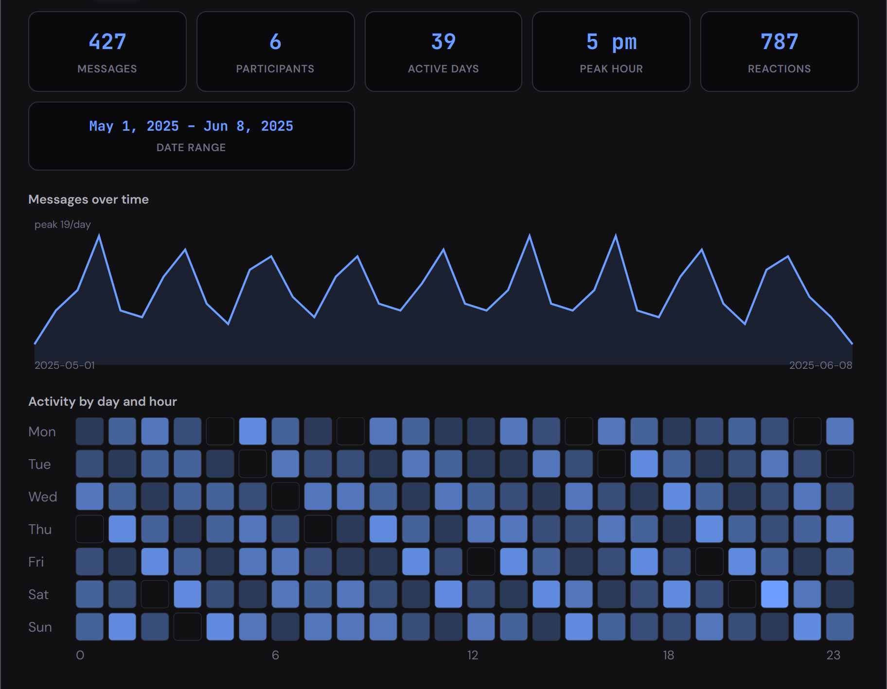
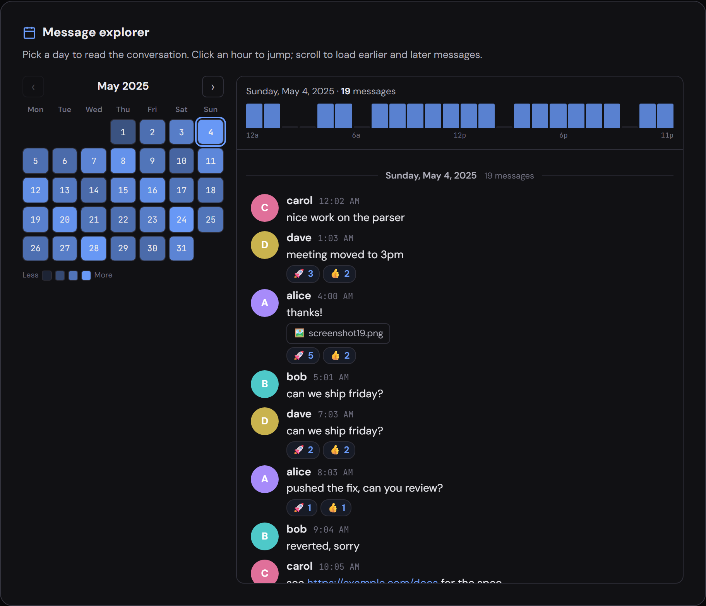
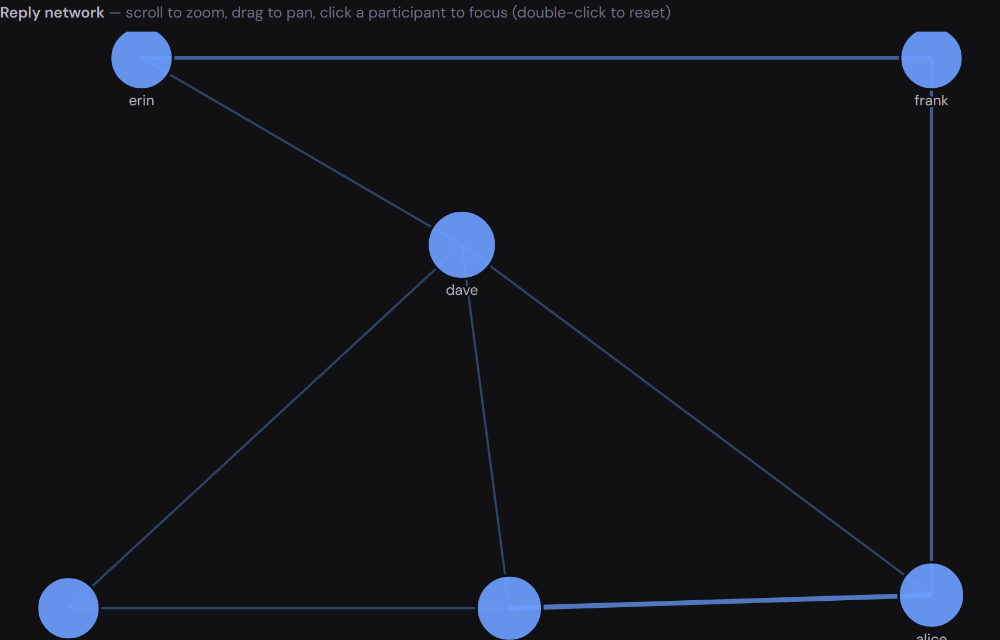
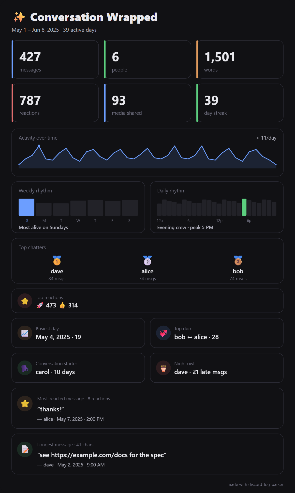

# Discord Log Parser

[](https://github.com/JohnSalchichonGH/discord-log-parser/actions/workflows/ci.yml)
[](https://codecov.io/gh/JohnSalchichonGH/discord-log-parser)

Two tools in one for Discord chat exports — and both run entirely in your browser
as a single self-contained HTML file (no server, no uploads, **zero** network
requests):

- **Convert** a noisy export into compact, **LLM-ready text** that packs as much
  conversation as possible into a context window.
- **Explore** it visually — an activity dashboard, a heat calendar you can read
  like a chat, a reply network, and a shareable "Wrapped" recap.

Built from `.json`, `.html`, and `.txt` exports produced by
[DiscordChatExporter](https://github.com/Tyrrrz/DiscordChatExporter) — mix all
three in one session and they're merged into one conversation.

---

## Export → compact, LLM-ready text

Strips the HTML/metadata overhead and reformats the conversation into a dense
plain-text format: short author IDs, relative timestamps, day/session dividers,
media collapsed to tokens, reactions and replies inlined.

```
# LLM-Optimized Chat Log (Limit: ~200,000 tokens)
# Start: Sat, 12 Jul 2025 03:50:00 GMT
# Participants:
# U1: kang0420 (42 msgs, 35.0%)
# U2: tetron432 (38 msgs, 31.7%)

=== Saturday, Jul 12, 2025 ===

[3:50 AM] U1:
  Joined the server.
  greetings
[+0s] U2:
  yo you guys
  stop deleting servers for crying out loud

=== SESSION BREAK (4h 12m) ===

[8:14 AM] U1:
  [IMG: eyechart.jpg] ^{👍:3}
```

---

## Explore → read &amp; understand the log

All computed over the full conversation (before token trimming), off the main
thread, with a **UTC / Local** timezone toggle.

**Insights dashboard** — totals, activity over time, a day×hour heatmap,
leaderboards, top reactions and media, with a live per-user filter.



**Message explorer** — a heat calendar; click any day to read it as a Discord-style
chat with avatars, replies, media chips, reactions and an hour scrubber. Scroll to
load earlier/later messages.



**Reply network** — who replies to whom, force-directed; scroll to zoom, drag to
pan, and click a person to focus them.



**Wrapped** — a shareable recap poster (one-click **Download PNG**): activity
rhythms, a top-3 podium, busiest day, top reply duo, night owl, and more.



---

## Quick start

```bash
npm install && npm run dev   # dev server with hot reload
# …or build a standalone file you can double-click (no server needed):
npm run build                # → dist/index.html  (fully self-contained)
```

Then walk the four steps: **Upload** exports → **Configure** budget/filters →
**Preview** (output + all the analytics above) → **Export**.

---

## Supported inputs

Quality runs **JSON > HTML > TXT** — prefer JSON when you have it.

| Format           | IDs & timestamps                | Notes                                                                          |
| ---------------- | ------------------------------- | ------------------------------------------------------------------------------ |
| `.json` _(rec.)_ | Stable IDs, ISO-8601 timestamps | Most reliable; the only safe choice for non-US-locale exports.                 |
| `.html`          | Stable IDs                      | Full content: replies, attachments, embeds, stickers, reactions, system notes. |
| `.txt`           | No IDs, minute-resolution clock | Lossiest, but still parsed and de-duplicated (best-effort).                    |

---

## Features

**Export controls**

- **Token budget** with one-click model presets (keeps the newest messages, trims
  the oldest to fit); live character/token estimate.
- **Keyword-priority retention** — messages matching your terms (plain text or
  `/regex/`) are always kept, even over budget.
- **Filters** — date range, per-user whitelist, low-activity cutoff, and
  bot / system-notification / media-only exclusion.
- **Redaction** — anonymize names, strip URLs, emails and phone numbers.
- **Custom preamble**, and output as **TXT / JSON / Markdown / CSV** with optional
  **chunking** (overlapping windows for multi-pass analysis).

**Merging & identity**

- Multiple files for the same channel — in any format — are merged, with
  cross-format **de-duplication** (a `.txt` copy of an HTML/JSON message is
  dropped, but a message only the `.txt` captured is kept).
- **One global identity** across all files: a person active in several channels is
  a single identity everywhere, shown by their **most recent nickname**.

**Quality of life** — dark/light theme, settings persisted to `localStorage`, and
a live scrollable output preview with copy-to-clipboard.

---

## Privacy

Everything runs locally; no data leaves your browser. The built `dist/index.html`
makes **zero network requests** — fonts are inlined, there's no analytics, and a
strict Content-Security-Policy (`connect-src 'none'`, `default-src 'none'` with
narrow exceptions) blocks `fetch`, `XMLHttpRequest`, WebSocket, `EventSource` and
`sendBeacon` as defense-in-depth. Untrusted export content is HTML-escaped before
display.

---

## Limitations

- **`.txt` is best-effort.** With no IDs and a minute-resolution clock in an unknown
  timezone, cross-format de-duplication matches `.txt` messages at day granularity —
  so the same person posting identical text on the same day across channels could
  occasionally over-merge. Prefer JSON/HTML when accuracy matters.
- `.txt` timestamps are parsed in local time (what Discord showed the exporter), and
  `.txt` reactions carry no counts (so `^{👍}`, not `^{👍:3}`).
- Edited messages reflect only the version present at export time.
- The default build uses a `1 token ≈ 4 chars` estimate. For exact counts, use
  `dist/index-accurate.html` (real GPT `cl100k_base` BPE tokenizer, opt-in toggle).
- Token-budget trimming is calibrated for the Compact TXT output; the JSON/Markdown/
  CSV formats and chunk sizes may run larger than the selected budget.
- Media appears in the explorer as labeled chips, not thumbnails (exports are text,
  so there's no image data).

---

## Development

The app is plain ES modules under `src/`, built into a single dependency-free
`dist/index.html` (JS, CSS and fonts inlined) so the "double-click to run" file is
preserved. All parsing/processing/analytics/rendering logic lives in tested modules;
`src/ui/*.js` is the DOM/visualization layer.

```bash
npm test            # Vitest suite (130 tests)
npm run coverage    # tests + V8 coverage (lcov/html)
npm run lint        # ESLint   ·   npm run format  (Prettier)
npm run build:all   # both builds: lean + accurate-tokenizer
```

CI runs lint, format check, tests with coverage (uploaded to Codecov), and both
builds on every push. See **[CONTRIBUTING.md](CONTRIBUTING.md)** for the
architecture, module layout, and build internals.

---

## License

[MIT](LICENSE).
